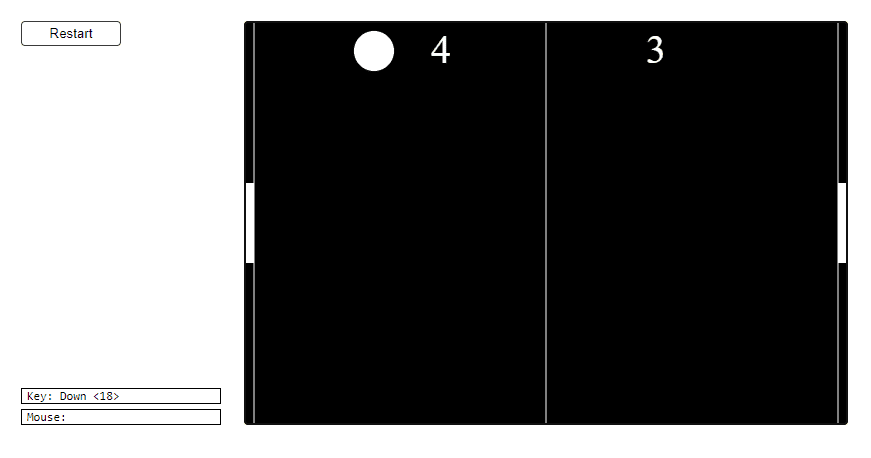

Pong Game: A Classic Reimagined in Python
=========================================  

[Game Link](https://py2.codeskulptor.org/#user38_VNtpAkYb9cnHgqb.py) Just click on the play button to launch the game.  

The "Pong Game" represents a digital twist on the classic Pong arcade game and stands as the Week 4 project for Rice University's MOOC (Massive Open Online Course) titled "Introduction to Interactive Programming in Python." This Python-powered game showcases creativity and programming skills, offering an engaging experience that blends nostalgia with modern technology.

## Key Features:

1. *Educational Excellence*: Serving as a testament to the knowledge and coding proficiency acquired during the course, the "Pong Game" allows students to put their skills to the test by developing an interactive and enjoyable game.

2. *Python Mastery*: Developed exclusively using Python, this project enables students to apply their programming expertise in a practical context, reinforcing their understanding of the language.

3. *Classic Recreation*: Immerse yourself in the world of Pong, where players control paddles to bounce a ball back and forth. The game pays homage to the timeless arcade classic.

4. *SimpleGUI Magic*: Built with the SimpleGUI library from CodeSkulptor, the game provides an accessible and interactive user interface, enhancing the overall gaming experience.

5. *Multiplayer Potential*: For those keen to collaborate with friends or family, the "Pong Game" offers a two-player mode, adding an element of competition and social interaction.

6. *Interactive Learning*: Exploring the game's code provides students with valuable insights into game development, user input handling and logic implementation in Python.

The "Pong Game" is not merely a recreational distraction; it is a testament to the programming skills and creative potential unleashed during the MOOC. Whether you're a student completing the course or a gaming enthusiast yearning for a modern take on a beloved classic, this project delivers an entertaining and educational gaming experience. Rediscover the joy of Pong with a digital twist, all crafted in Python.  

  
